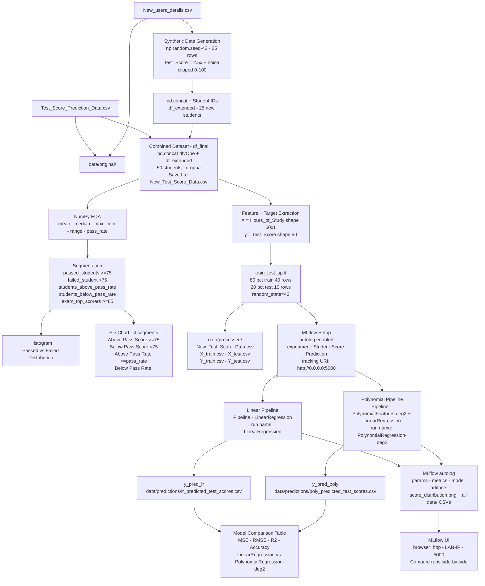

# Architecture Diagram v2 — Student Mark Prediction Pipeline



## Server Launch

```bash
mlflow ui --host 0.0.0.0 --port 5000
```

Browse to `http://<your-LAN-IP>:5000` — find your IP with `ipconfig` (Windows) or `ip a` (Linux/Mac).

## Folder Structure

```
project/
├── data/
│   ├── original/
│   │   ├── Test_Score_Prediction_Data.csv
│   │   └── New_users_details.csv
│   ├── processed/
│   │   ├── New_Test_Score_Data.csv
│   │   ├── X_train.csv
│   │   ├── X_test.csv
│   │   ├── Y_train.csv
│   │   ├── Y_test.csv
│   │   └── score_distribution.png
│   └── predictions/
│       ├── lr_predicted_test_scores.csv
│       └── poly_predicted_test_scores.csv
├── StudentMarkPrediction.ipynb
├── Test_Score_Prediction_Data.csv
├── New_users_details.csv
├── New_Test_Score_Data.csv
└── mlruns/   ← created automatically by MLflow
```
